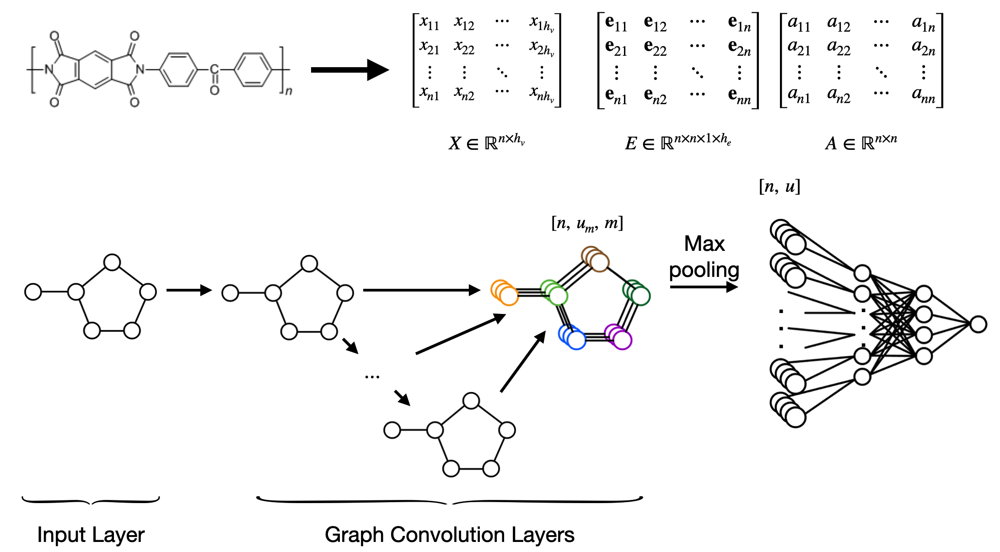
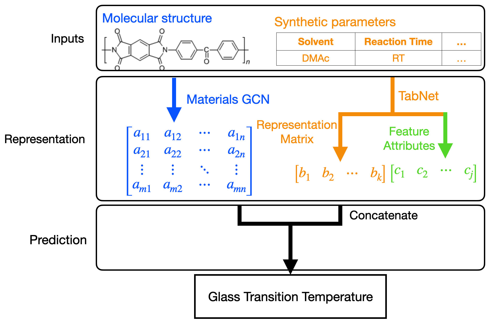
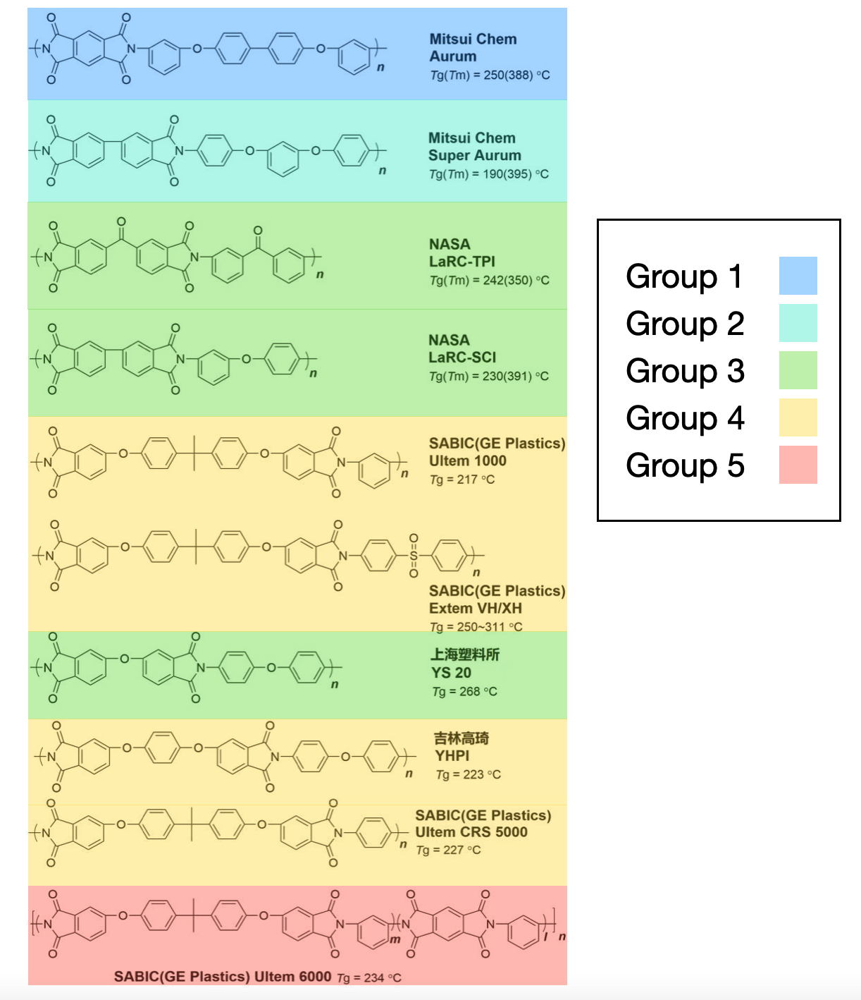

# Dataset

data collecting conditions

1. Polyimides & homopolymer & glass transition temperature (Tg)
2. synthetic parameters
   - step 1: solvent, reaction time and temperature
   - step 2: minimum reaction temperature, maximum reaction temperature and reaction time

Dataset

| No   | Condition                         | Size | Purpose               | Size after data cleaning |
| ---- | --------------------------------- | ---- | --------------------- | ------------------------ |
| 1    | delete duplicated molecules       | 881  | GCN training          | 876                      |
| 2    | use two-step method to synthesize | 635  | MMGCN training        | 622                      |
| 3    | intersection of dataset 1 & 2     | 522  | GCN & MMGCN comparing | 516                      |

# EXP1 GCN

use dataset 1

parameters

| lr   | batchSize | weight decay | hidden | graphs | Dense | maxAtoms | edgeLayers | edgeBias   | dropout | degree |
| ---- | --------- | ------------ | ------ | ------ | ----- | -------- | ---------- | ---------- | ------- | ------ |
| 0.01 | 16        | 0.005        | 64     | 4      | 8     | 80       | All        | even layer | 0.3     | 2      |

result

| trainLoss | trainAccu | valLoss  | valAccu  | testLoss | testAccu |
| --------- | --------- | -------- | -------- | -------- | -------- |
| 24.48531  | 22.64333  | 29.03335 | 27.19137 | 28.32887 | 26.48689 |

* decrease by 3.84℃ after adding the bond features

# EXP2 Multi-modal Materials GCN

steps

1. train Materials GCN part
2. train TabNet

parameters

| lr   | batchSize | gen dense | fearture dimension | output dimension | num decision steps | relaxation factor |
| ---- | --------- | --------- | ------------------ | ---------------- | ------------------ | ----------------- |
| 0.01 | 32        | 32        | 8                  | 4                | 4                  | 1.5               |

result

| trainAccu | valAccu  | testAccu |
| --------- | -------- | -------- |
| 20.41369  | 25.15167 | 24.91037 |

* decrease by 1.58℃ after adding synthetic parameters

# EXP3 Compare

use dataset 3

MaterialsGCN

| trainLoss | trainAccu | valLoss  | valAccu  | testLoss | testAccu |
| --------- | --------- | -------- | -------- | -------- | -------- |
| 27.06340  | 25.57396  | 32.23703 | 30.74669 | 30.07337 | 28.58302 |

Multi-modal MaterialsGCN

| trainAccu | valAccu  | testAccu |
| --------- | -------- | -------- |
| 21.73884  | 26.43369 | 27.09359 |

# Interpretability

### molecular structure

Use kmeans cluster to explore the interpretability of the polyimides structure representation matrix (after max pooling layer)

### Synthetic parameters

| Materials Structure data                | Feature Arributes |
| --------------------------------------- | ----------------- |
| Solvent                                 | 1.35665           |
| Method (step two)                       | 0.76842           |
| Minimum reaction temperature (step two) | 0.38442           |
| Maximum reaction temperature (step two) | 0.11288           |
| Reaction time (step two)                | 0.02037           |
| Reaction temperature (step one)         | 0.00640           |
| Reaction time (step one)                | 0.00005           |

* solvent and the method used in step two are more related to polyimides feature $T_g$
