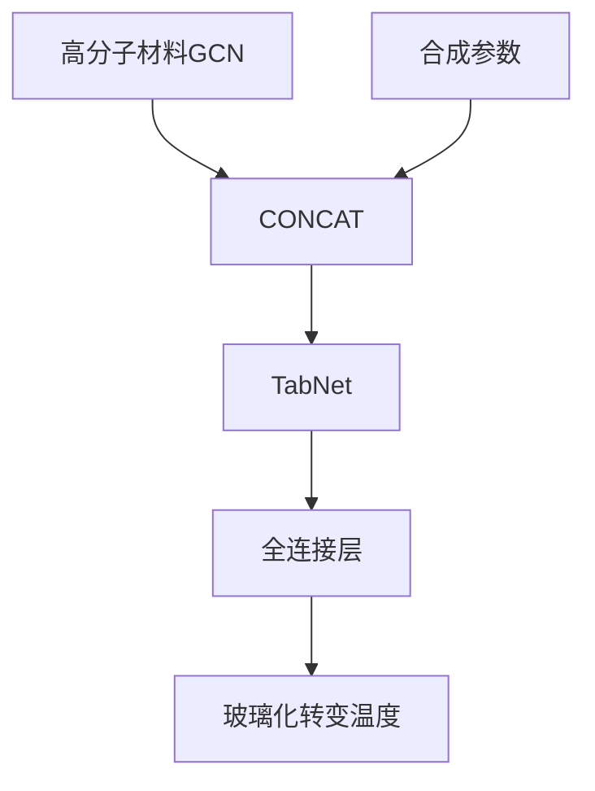
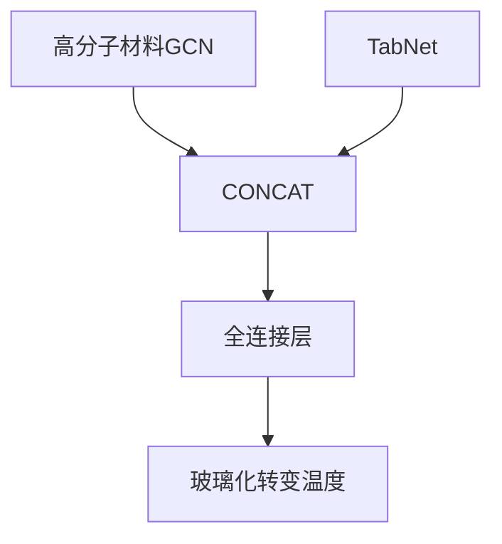

# 数据集

数据收集条件

1. 聚酰亚胺，homopolymer，有Tg数据
2. 包含所需的合成参数
   - 一步法：反应类型，溶剂，反应温度，反应时间
   - 两步法：反应类型，溶剂，反应温度，反应时间，第二步使用的方法，最小反应温度，最大反应温度，反应时间

- 存在相同材料分子但合成参数不同的情况

数据集

- 共收集数据1015条

- | No   | 条件                         | 数量 | 用途               | 删除异常点后的数据量 |
  | ---- | ---------------------------- | ---- | ------------------ | -------------------- |
  | 1    | 删除重复材料分子，保留第一条 | 881  | 训练GCN模型        | 876                  |
  | 2    | 两步法数据                   | 635  | 训练MMGCN模型      | 622                  |
  | 3    | 两步法数据删除重复材料分子   | 522  | 对比GCN与MMGCN模型 | 463+53=516           |
  
  分成dataset x.1以及dataset x.2 
  
  - dataset x.1作为训练数据集
  - dataset x.2用于测试模型的通用性
  

# EXP 1 训练GCN

使用删除重复分子的所有数据训练GCN模型
$$
H^{(l)}=\sum_{i=0}^{2}S_iH^{(l-1)}W_i
$$
对于一阶：
$$
A_{i,j} =sigmoid(W_{i,j}V_{i,j}+b)\\
H^{(l)}=(A\odot S_i)H^{(l-1)}W_i
$$

* 参数

  | lr   | batchSize | weight decay  | hidden | graphs | Dense | maxAtoms | edgeLayers | edgeBias | dropout | degree |
  | ---- | --------- | ------------- | ------ | ------ | ----- | -------- | ---------- | -------- | ------- | ------ |
  | 0.01 | 16        | 0.005(前三层) | 64     | 4      | 8     | 80       | All        | 间隔     | 0.3     | 2      |

* result - dataset 1.1

  | trainLoss | trainAccu | valLoss | valAccu  | testLoss | testAccu |
  | --------- | --------- | ------- | -------- | -------- | -------- |
  | 21.99155  | 20.87298  | 31.1128 | 29.99423 | 24.45974 | 23.34117 |

* result - dataset 1.2

  | Loss     | Accuracy |
  | -------- | -------- |
  | 47.24541 | 46.12684 |

* Save path: ./myGCN/GCN_23/gcn.ckpt

# EXP 2 训练MMGCN

使用所有两步法数据训练MMGCN (TabNet+GCN)

## 方案 1 

### 模型结构

### 实验步骤

1. 训练GCN模型
2. 训练TabNet

### 实验结论

数据量小，TabNet模型相对较复杂，若直接使用TabNet的输出连接，过拟合严重

## 方案 2

### 模型结构

### 实验步骤

设计1

1. 同时训练GCN和TabNet

设计2

1. 训练GCN
2. 训练TabNet

- [x] 设计3

1. 训练GCN
2. 训练TabNet
3. 训练ALL

### 实验结论

设计1

* 完全降不下去

设计2

* 训练结果有一定下降，但幅度不大=> 设计3

设计3

* 没什么用，跟设计2差不多

## 实验最优结果

* 参数

  | lr   | batchSize | gen dense | fearture dimension | output dimension | num decision steps | relaxation factor |
  | ---- | --------- | --------- | ------------------ | ---------------- | ------------------ | ----------------- |
  | 0.01 | 32        | 32        | 8                  | 4                | 4                  | 1.5               |

* result

  | trainAccu | R2      | valAccu  | R2      | testAccu | R2      |
  | --------- | ------- | -------- | ------- | -------- | ------- |
  | 21.00995  | 0.67619 | 27.14547 | 0.66798 | 24.97895 | 0.46876 |

  | trainAccu | R2      | valAccu  | R2      | testAccu | R2      |
  | --------- | ------- | -------- | ------- | -------- | ------- |
  | 20.41369  | 0.69082 | 25.15167 | 0.70094 | 24.91037 | 0.50544 |

* Save path: ./myMMGCN/MMGCN/mmgcn.ckpt

# EXP3 比较

GCN

| trainLoss | trainAccu | R       | valLoss  | valAccu  | R       | testLoss | testAccu | R       |
| --------- | --------- | ------- | -------- | -------- | ------- | -------- | -------- | ------- |
| 27.06340  | 25.57396  | 0.57902 | 32.23703 | 30.74669 | 0.60007 | 30.07337 | 28.58302 | 0.59284 |

MMGCN
