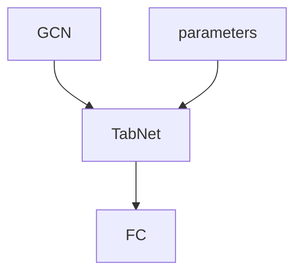
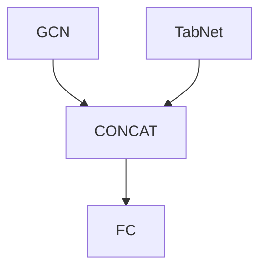

## 数据预处理

**PID与mol文件** 转换为对应的SMILES

**Tg** 不变

**Tg_Method**
* 使用所有检测方法得到的温度
* 使用某一特定检测方法得到的温度

**Type (Polyaddition, Polycondensation)**
* 使用该特征
* 不使用该特征

**Method**
* 选择一步法
* 选择两步法

**Solvent** 不变

**Temperature1**
* 分箱

**Time1**
* 分箱

**Method2** 不变

**min_temp**

**max_temp**

**Time2**

# 数据集

数据收集条件

1. 聚酰亚胺，homopolymer，有Tg数据
2. 包含所需的合成参数
   - 一步法：反应类型，溶剂，反应温度，反应时间
   - 两步法：反应类型，溶剂，反应温度，反应时间，第二步使用的方法，最小反应温度，最大反应温度，反应时间

- 存在相同材料分子但合成参数不同的情况

数据集

- 共收集数据1015条

- | No   | 条件                         | 数量 | 用途               | 删除异常点后的数据量 |
  | ---- | ---------------------------- | ---- | ------------------ | -------------------- |
  | 1    | 删除重复材料分子，保留第一条 | 881  | 训练GCN模型        | 787+89=876           |
  | 2    | 两步法数据                   | 635  | 训练MMGCN模型      | 559+63=622           |
  | 3    | 两步法数据删除重复材料分子   | 522  | 对比GCN与MMGCN模型 | 463+53=516           |

  分成dataset x.1以及dataset x.2 

  - dataset x.1作为训练数据集
  - dataset x.2用于测试模型的通用性

# EXP 1 训练GCN

使用删除重复分子的所有数据训练GCN模型

* 参数

  | lr   | batchSize | weight decay | hidden | graphs | dropout | degree |
  | ---- | --------- | ------------ | ------ | ------ | ------- | ------ |
  | 0.01 | 16        | 0.05         | 64     | 5      | 0.3     | 2      |

* result - dataset 1.1

  | trainLoss | trainAccu | valLoss  | valAccu  | testLoss | testAccu |
  | --------- | --------- | -------- | -------- | -------- | -------- |
  | 30.11712  | 28.92872  | 32.27017 | 31.08177 | 28.51193 | 27.32353 |

* result - dataset 1.2

  | Loss     | Accuracy |
  | -------- | -------- |
  | 55.31946 | 54.13107 |

* Save path: ./myGCN/GCN/gcn.ckpt

### 实验结论

- [ ] 对于较长的分子预测效果差

# EXP 2 训练MMGCN

使用所有两步法数据训练MMGCN (TabNet+GCN)

## 方案 1 

### 模型结构

### 实验步骤

1. 训练GCN模型
2. 训练TabNet

### 实验结论

数据量小，TabNet模型相对较复杂，若直接使用TabNet的输出连接，过拟合严重

## 方案 2

### 模型结构

### 实验步骤

设计1

1. 同时训练GCN和TabNet

设计2

1. 训练GCN
2. 训练TabNet

- [x] 设计3

1. 训练GCN
2. 训练TabNet
3. 训练ALL

### 实验结论

设计1

* 完全降不下去

设计2

* 训练结果有一定下降，但幅度不大=> 设计3

设计3

* 没什么用，跟设计2差不多

## 实验最优结果

* 参数

  | lr   | batchSize | gen dense | fearture dimension | output dimension | num decision steps | relaxation factor |
  | ---- | --------- | --------- | ------------------ | ---------------- | ------------------ | ----------------- |
  | 0.01 | 32        | 32        | 8                  | 4                | 4                  | 1.5               |

* result - dataset 2.1

  | trainAccu | valAccu  | testAccu |
  | --------- | -------- | -------- |
  | 22.08470  | 20.97842 | 25.63186 |

* result - dataset 2.2

  | Accuracy |
  | -------- |
  | 46.78223 |

* Save path: ./myMMGCN/MMGCN_4/mmgcn.ckpt

